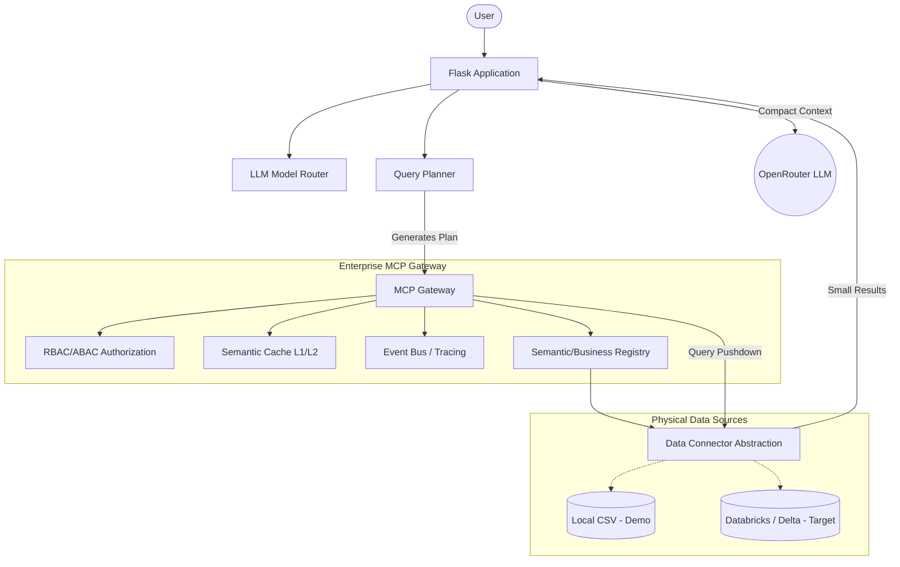

# Enterprise Architecture Target vs Demo

The Utilities Knowledge Hub has been evolved to demonstrate an **Enterprise Architecture** while retaining the ability to run on zero-cost infrastructure like Render Free.

## Architecture Diagram

## Demo Implementation vs Enterprise Target

| Component | Demo Implementation (Render Free) | Enterprise Target |
| :--- | :--- | :--- |
| **Data Backend** | `CSVConnector` (Pandas + DuckDB) | `DatabricksConnector` (Unity Catalog, Delta Tables) |
| **Caching** | `OrderedDict` (In-process memory, TTL) | Redis Cluster (Distributed semantic caching) |
| **Event Bus** | `asyncio.Queue` (In-process async callbacks) | Kafka / Azure Event Hubs / AWS EventBridge |
| **Authorization** | `AuthorizationManager` (Hardcoded roles) | Azure Entra ID / AWS IAM + Unity Catalog ABAC |
| **LLM Routing** | Single configured fast model (e.g. Haiku) | Dynamic fallback (Fast Model -> Reasoning Model) |

## Security & Performance Highlights
1. **Query Pushdown**: Agents no longer read raw datasets. The `MCPGateway` ensures filters and limits are pushed down to DuckDB before context is sent to the LLM.
2. **Parallel MCP Execution**: The `PlanExecutor` uses `asyncio.gather()` to run independent tool calls concurrently.
3. **RBAC & ABAC**: Implemented at the Gateway level (e.g., Operations Managers can only access data for their assigned region).
4. **Semantic Layer**: The LLM reasons about `EngineerProductivity` rather than physical `engineer_productivity.csv`.

## Databricks Migration Plan
To move from the CSV demo to Databricks:
1. Set `DATA_BACKEND=databricks` in `.env`.
2. Provide `DATABRICKS_HOST` and `DATABRICKS_TOKEN`.
3. The `BaseDataConnector` abstraction ensures no agent prompts or business logic needs to change.
