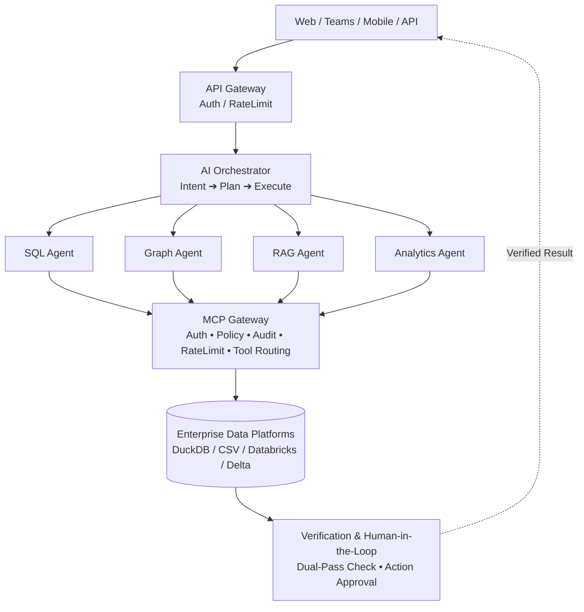

# 🔧 Utilities Knowledge Hub

> **An AI-powered enterprise chatbot for utilities companies** — combining Knowledge Graph traversal, RAG document retrieval, dataset access governance, and automated IT ticket escalation into a single intelligent interface.

[](https://python.org)
[](https://flask.palletsprojects.com)
[](https://langchain.com)
[](https://networkx.org)
[](https://openrouter.ai)
[](./LICENSE)

---

## 📋 Table of Contents

- [Overview](#-overview)
- [Key Features](#-key-features)
- [Architecture & Interaction Flow](#%EF%B8%8F-architecture--interaction-flow)
- [Enterprise Architecture Evolution](#-enterprise-architecture-evolution)
- [Project Structure](#-project-structure)
- [Tech Stack](#-tech-stack)
- [Getting Started](#-getting-started)
  - [Prerequisites](#prerequisites)
  - [Installation](#installation)
  - [Configuration](#configuration)
  - [Running Locally](#running-locally)
- [Usage](#-usage)
  - [Chat Interface](#chat-interface)
  - [Example Queries](#example-queries)
- [API Reference](#-api-reference)
- [Dataset Schema](#-dataset-schema)
- [Agent Tools](#-agent-tools)
- [Knowledge Graph Pipeline](#-knowledge-graph-pipeline)
- [Access Control Model](#-access-control-model)
- [Testing](#-testing)
- [Deployment](#-deployment)
  - [Render (Recommended)](#render-recommended)
  - [Posit Connect Cloud](#posit-connect-cloud)
- [Multi-Cloud & Databricks Migration](#%EF%B8%8F-multi-cloud--databricks-migration)
- [Enterprise MCP Server & Client Setup](#-enterprise-mcp-server--client-setup)
- [Competitive Differentiation](#-competitive-differentiation)
- [Configuration Reference](#%EF%B8%8F-configuration-reference)
- [Contributing](#-contributing)
- [License](#-license)

---

## 🌐 Overview

The **Utilities Knowledge Hub** is an enterprise-grade AI chatbot designed for utilities companies (gas, heating, energy services). It serves as a unified knowledge portal for project teams — enabling them to:

- **Troubleshoot** equipment faults and boiler error codes using a semantically-indexed Knowledge Graph.
- **Discover** enterprise datasets, data lineage, and Subject Matter Expert (SME) attribution.
- **Request access** to restricted operational datasets via automated IT ticket generation (ServiceNow-style).
- **Query live telemetry** metrics and business operations data with role-based access control.

The system operates in two modes:
1. **Deterministic fallback engine** — works fully offline without an LLM API key, using rule-based routing over the Knowledge Graph.
2. **LLM-augmented mode** — when an OpenRouter/OpenAI API key is provided, a LangChain-powered language model synthesizes natural language answers grounded in verified local evidence.

---

## ✨ Key Features

| Feature | Description |
|---|---|
| 🕸️ **Knowledge Graph RAG** | NetworkX + LangChain `NetworkxEntityGraph` for hybrid document + graph retrieval |
| 🤖 **AI Agentic Chatbot** | LangChain-powered agent with 9 custom tools and a deterministic fallback engine |
| 🔒 **Role-Based Access Control** | `Customer / Employee / Admin` permission tiers enforced per dataset |
| 🎫 **IT Ticket Automation** | Auto-generates ServiceNow-style access request tickets (TICK-XXXX) |
| 📊 **Live Telemetry Queries** | Reads live metrics (pressure PSI, flame current, flow rate) from Excel datasets |
| 🏭 **12-Stage Pipeline Visualizer** | Interactive OEM Knowledge Base ingestion pipeline with 12 flex-expanding stage cards |
| 🗂️ **Data Lineage & SME Attribution** | Tracks which SME owns each enterprise dataset and its governance policy |
| 📈 **Installation Forecasting** | Directional boiler installation forecasts from sales pipeline conversion data |
| 💬 **Multi-Turn Conversation Memory** | Session-scoped chat history with context-aware follow-up resolution |
| 🚀 **Zero-Config Startup** | Auto-generates Excel mock datasets on first launch if files are missing |

---

## 🏗️ Architecture & Interaction Flow

The Utilities Knowledge Hub is structured in an enterprise-grade, multi-tiered architecture that seamlessly connects client interfaces, intelligent orchestration, specialized sub-agents, an **Enterprise MCP Gateway**, and zero-trust verification.

```
┌─────────────────────────────────────────────────────────────┐
│                 Web / Teams / Mobile / API                  │
└──────────────────────────────┬──────────────────────────────┘
                               │
                               ▼
┌─────────────────────────────────────────────────────────────┐
│                         API Gateway                         │
│                      Auth / RateLimit                       │
└──────────────────────────────┬──────────────────────────────┘
                               │
                               ▼
┌─────────────────────────────────────────────────────────────┐
│                       AI Orchestrator                       │
│                   Intent ➔ Plan ➔ Execute                 │
└──────────────────────────────┬──────────────────────────────┘
                               │
         ┌───────────────┬─────┴─────────┬───────────────┐
         ▼               ▼               ▼               ▼
   ┌───────────┐   ┌───────────┐   ┌───────────┐   ┌───────────┐
   │ SQL Agent │   │Graph Agent│   │ RAG Agent │   │ Analytics │
   └─────┬─────┘   └─────┬─────┘   └─────┬─────┘   └─────┬─────┘
         │               │               │               │
         └───────────────┴─────┬─────────┴───────────────┘
                               │
                               ▼
┌─────────────────────────────────────────────────────────────┐
│                         MCP Gateway                         │
│       Auth • Policy • Audit • RateLimit • Tool Routing      │
└──────────────────────────────┬──────────────────────────────┘
                               │
                               ▼
┌─────────────────────────────────────────────────────────────┐
│                  Enterprise Data Platforms                  │
│             DuckDB / CSV / Databricks / Delta               │
└──────────────────────────────┬──────────────────────────────┘
                               │
                               ▼
┌─────────────────────────────────────────────────────────────┐
│              Verification & Human-in-the-Loop               │
│               Dual-Pass Check • Action Sign-Off             │
└─────────────────────────────────────────────────────────────┘
```

---

### 🔄 End-to-End System Flow (Mermaid)



---

### 🧩 How Agents, Relation Graph, RAG, and MCP Work Together

Each component solves a specific dimension of enterprise reasoning. When combined, they eliminate the limitations of flat vector search and ungrounded LLM hallucination:

```
┌──────────────────────────────────────────────────────────────────────────────────────────┐
│                                   USER QUERY                                             │
│       "Why did boiler repair productivity decline in London despite sufficient capacity?"│
└────────────────────────────────────────────┬─────────────────────────────────────────────┘
                                             │
                       ┌─────────────────────▼─────────────────────┐
                       │               AI AGENT                    │
                       │   (Intent Analysis & Multi-Step Reasoning)│
                       └───────┬──────────────┬─────────────┬──────┘
                               │              │             │
        ┌──────────────────────┘              │             └──────────────────────┐
        ▼                                     ▼                                    ▼
┌──────────────┐                     ┌─────────────────┐                  ┌────────────────┐
│RELATION GRAPH│                     │   RAG SERVICE   │                  │  MCP GATEWAY   │
│(NetworkX KG) │                     │ (Docs & Manuals)│                  │(Structured DB) │
└───────┬──────┘                     └────────┬────────┘                  └────────┬───────┘
        │                                     │                                    │
        │ • Maps failure modes & codes        │ • Retrieves technical boiler specs │ • Applies RBAC/ABAC (London)
        │ • Traverses dataset dependencies    │ • Explains cold-weather procedures │ • Query pushdown via DuckDB
        │ • Identifies SME owners & lineage   │ • Provides maintenance guidance    │ • L1/L2 Semantic Caching
        │                                     │                                    │
        └──────────────────────┬──────────────┴─────────────┬──────────────────────┘
                               │                            │
                               ▼                            ▼
                      ┌──────────────────────────────────────────────┐
                      │             GROUNDED ANSWER SYNTHESIS        │
                      │  • Lineage Subgraph displayed in UI          │
                      │  • Dual-Pass Verification of headline claims │
                      │  • Human-in-the-Loop Action Proposal queued  │
                      └──────────────────────────────────────────────┘
```

#### 1. 🤖 AI Agent Loop (`AgentRuntime` & `QueryPlanner`)
* **Role**: The conductor and reasoning engine.
* **How it works**: When a question arrives, the `QueryPlanner` decomposes complex, multi-part questions into discrete execution steps. The agent loop iteratively selects tools, inspects returns, self-corrects on edge cases, and chains calls across systems before synthesizing the answer.
* **Coordination**: The agent does not guess numbers or schema structures. It routes document inquiries to **RAG**, relationship and lineage questions to the **Knowledge Graph**, and KPI/metric queries to the **MCP Gateway**.

#### 2. 🕸️ Relation Graph (`KnowledgeGraphService` / NetworkX)
* **Role**: Structural connectivity, entity relationships, and governance lineage.
* **How it works**: Maintained as an in-memory multidimensional `DiGraph` containing entities (e.g., Boilers, Faults, Error Codes, Datasets, SME Owners, Mitigation Steps) and typed edges (`CAUSES`, `RESOLVED_BY`, `DOCUMENTED_IN`, `OWNED_BY`).
* **Coordination with RAG & MCP**:
  - When RAG identifies an error code (e.g., `F.28`), the Relation Graph instantly traces which physical datasets capture its telemetry, which parts are required, and which SME data steward governs that domain.
  - Generates the interactive **Grounding Lineage Subgraph** returned with every chat answer to visually prove how the answer was derived.

#### 3. 📚 Document RAG Service (`rag_service.py`)
* **Role**: Unstructured contextual knowledge retrieval.
* **How it works**: Performs vector and BM25 similarity search across boiler technical manuals, operational standard operating procedures (SOPs), and OEM documentation.
* **Coordination with Graph & Agent**:
  - Provides the qualitative "how" and "why" behind equipment behavior.
  - The agent cross-references RAG text extracts against the Relation Graph to verify that manual recommendations match active enterprise inventory and policies.

#### 4. 🛡️ Enterprise MCP Gateway (`app/services/mcp_gateway`)
* **Role**: Governed, secure, high-performance structured data access.
* **How it works**:
  - **Semantic Business Layer**: Translates high-level business metrics (e.g. `quote_to_sale_conversion_rate`, `net_appointments`) into optimized physical SQL queries.
  - **Zero-Trust ABAC / RBAC**: Enforces data entitlement boundaries (e.g., an Operations Manager for London automatically has `region = 'London'` pushed down into their query).
  - **Context Minimization & Pushdown**: Executes filtering and aggregation directly in the DuckDB SQL engine and returns capped result sets (`MAX_MCP_ROWS`), preventing LLM context window overflow.
  - **Multi-Level Semantic Caching**: L1 (entity schema/metadata) and L2 (query results with TTL) eliminate redundant database queries.

#### 5. 🔍 Dual Verification & Human-in-the-Loop Governance
* **Independent Claim Derivation (`verifier.py`)**: After the agent generates an answer, an isolated verification worker re-runs SQL derivations against the underlying datasets to independently prove all quoted numbers.
* **Action Approval Queue (`HubStore`)**: When analysis suggests operational modifications (e.g., capacity shift, price changes, forecast overrides), the agent queues a proposed action requiring explicit human sign-off (`Approve` / `Reject`) before any change record is logged.

---

## 📂 Project Structure

```
Utilities-Knowledge-Hub/
│
├── app.py                      # Entry point (Posit Connect Cloud / gunicorn)
├── wsgi.py                     # WSGI entry point
├── Procfile                    # Heroku-style process file
├── render.yaml                 # Render.com deployment config
├── requirements.txt            # Python dependencies
├── test_app.py                 # Automated verification test suite
├── .env.example                # Environment variable template
│
└── app/
    ├── __init__.py
    ├── main.py                 # Flask app, routes, and service initialization
    ├── config.py               # Environment config, paths, and mock data bootstrap
    │
    ├── agent/
    │   ├── agent_builder.py    # LangChain executor, deterministic fallback engine, chat processor
    │   └── tools.py            # 9 custom LangChain tools with service injection
    │
    ├── services/
    │   ├── graph_service.py    # NetworkX + LangChain Knowledge Graph (RAG, traversal, hybrid search)
    │   └── data_service.py     # Excel dataset access: metrics, operations, access permissions
    │
    ├── data/
    │   ├── Knowledge_Base.xlsx       # Entity-relationship knowledge graph data
    │   ├── Live_Metrics.xlsx         # Live telemetry readings
    │   ├── Business_Operations.xlsx  # Commercial funnel data
    │   ├── Metadata_Access.xlsx      # Dataset access permission policies per role
    │   └── generate_mock_data.py     # Auto-generates all Excel datasets with realistic mock data
    │
    └── templates/
        └── index.html          # Single-page chat UI with Knowledge Graph visualisation
```

---

## 🛠️ Tech Stack

| Layer | Technology |
|---|---|
| **Web Framework** | Flask |
| **AI / Agent** | LangChain (`langchain`, `langchain-openai`, `langchain-community`) |
| **LLM Gateway** | OpenRouter (compatible with any OpenAI-spec endpoint) |
| **Knowledge Graph** | NetworkX (`nx.DiGraph`) + LangChain `NetworkxEntityGraph` |
| **Data Storage** | Excel (`.xlsx`) via `pandas` + `openpyxl` |
| **WSGI Server** | Gunicorn |
| **Env Management** | `python-dotenv` |
| **Frontend** | Vanilla HTML/CSS/JS (single `index.html`) |

---

## 🚀 Getting Started

### Prerequisites

- Python **3.10+**
- `pip` (or `uv` for faster installs)
- An **OpenRouter API key** _(optional — the app runs fully offline in deterministic mode without one)_

### Installation

**1. Clone the repository**
```bash
git clone https://github.com/Soumyadipta2020/Utilities-Knowledge-Hub.git
cd Utilities-Knowledge-Hub
```

**2. Create and activate a virtual environment**
```bash
# Windows
python -m venv .venv
.venv\Scripts\activate

# macOS / Linux
python -m venv .venv
source .venv/bin/activate
```

**3. Install dependencies**
```bash
pip install -r requirements.txt
```

### Configuration

**1. Copy the environment variable template**
```bash
cp .env.example .env
```

**2. Edit `.env` and fill in your values**
```env
# Required for LLM-augmented mode (optional — app works without this)
OPENROUTER_API_KEY=your_openrouter_api_key_here

# Default model — any OpenRouter-compatible model ID
OPENROUTER_MODEL_NAME=openai/gpt-4o-mini

# OpenRouter API base URL
OPENROUTER_BASE_URL=https://openrouter.ai/api/v1
```

> **Note:** If `OPENROUTER_API_KEY` is omitted or set to the placeholder value, the application automatically falls back to the deterministic rule-based engine. All core features (Knowledge Graph, RAG, access requests, ticket generation) work fully offline.

### Running Locally

```bash
python app.py
```

The server starts at **http://127.0.0.1:5000** by default.

> On first launch, the app automatically generates all required Excel mock data files if they are missing.

---

## 💬 Usage

### Chat Interface

Navigate to `http://127.0.0.1:5000` in your browser. The single-page interface provides:

- **Executive Dark + Amber Orange Theme** — high-contrast modern interface styled with modern vector SVG icons
- **Conversational Chat Panel** — compact, gap-free message bubbles with real-time markdown formatting
- **Interactive Knowledge Graph Visualizer** — dynamic canvas explorer with cluster regions and inspectable nodes/edges
- **12-Stage Pipeline Visualizer** — flex-expanding stage cards providing no-scroll OEM Knowledge Base progress tracking
- **Role & Access Governance** — session email identification and permission tier enforcement

### Example Queries

| Query | What happens |
|---|---|
| `How do I fix an EA Error on Worcester Bosch 4000?` | RAG + Graph traversal returns error code details, components, and remedy steps |
| `Who is the SME for Sales_Funnel_Dataset?` | Graph-RAG returns SME attribution and data lineage paths |
| `What is the grid pressure PSI?` | Identifies `Live_Metrics` dataset, notifies of access restriction, offers IT ticket |
| `Yes, please raise an IT access request` | Generates `TICK-XXXX` ServiceNow-style access ticket |
| `What is sales conversion?` | Retrieves metric definition from Knowledge Base |
| `Where can I get the sales data?` | Context-aware: resolves prior conversation turn to `Business_Operations` dataset |
| `Show me installation forecast` | Returns directional installation forecast from sales pipeline |
| `What can you do?` | Returns capability overview |

---

## 📡 API Reference

### `POST /api/chat`

Send a chat message and receive an AI-grounded response.

**Request Body:**
```json
{
  "message": "How do I fix EA Error on Worcester Bosch 4000?",
  "user_email": "engineer@abc.com"
}
```

**Response:**
```json
{
  "success": true,
  "response": "🤖 ABC AI Knowledge Retrieval (Graph-RAG):\n\n...",
  "user_email": "engineer@abc.com",
  "access_required": false,
  "graph": {
    "query": "...",
    "nodes": [...],
    "edges": [...]
  }
}
```

| Field | Type | Description |
|---|---|---|
| `message` | `string` | User's query text |
| `user_email` | `string` | User identifier (used for session scoping and ticket generation) |

---

### `POST /api/pipeline/run`

Trigger the 12-stage OEM Knowledge Base ingestion pipeline. Regenerates all mock datasets and reloads the Knowledge Graph.

**Response:**
```json
{
  "success": true,
  "title": "OEM Knowledge Base",
  "overall_progress": 100,
  "knowledge_base_updated": true,
  "stages": [
    { "id": 1, "name": "File Upload", "icon": "📥", "status": "done", "log": "..." }
  ],
  "total_nodes": 42,
  "total_edges": 85
}
```

---

### `GET /api/graph/data`

Export the full Knowledge Graph as nodes and edges for frontend rendering.

**Response:**
```json
{
  "success": true,
  "total_nodes": 42,
  "total_edges": 85,
  "nodes": [
    { "id": "EA_Error", "label": "EA_Error", "category": "Error", "icon": "⚠️", "description": "..." }
  ],
  "edges": [
    { "source": "Worcester Bosch 4000", "target": "EA_Error", "relation": "has_error_code", "details": "..." }
  ]
}
```

**Node Categories:**

| Category | Icon | Examples |
|---|---|---|
| `SME` | 👤 | David Ross, Sarah Jenkins, Marcus Vance |
| `Dataset` | 📊 | Snowflake, SAP, Sales_Funnel_Dataset |
| `Error` | ⚠️ | EA_Error, F2_Error, E9_Error |
| `Equipment` | 🔧 | Worcester Bosch 4000, Baxi Combi |
| `Metric` | 📈 | Grid Pressure, Flame Current |

---

## 🔨 Agent Tools

Custom LangChain tools defined in `app/agent/tools.py`:

| Tool | Description |
|---|---|
| `query_knowledge_graph` | Traverse NetworkX graph for boiler models, error codes, and components |
| `search_knowledge_base_rag` | RAG keyword search over Knowledge Base records |
| `query_graph_rag` | **Hybrid** Graph-RAG: combines RAG retrieval + graph traversal + LangChain triples |
| `query_datasets_sql` | Read-only DuckDB SQL across every row of every dataset, including joins |
| `execute_pandas_query` | Row-level pandas inspection of a single dataset |
| `query_live_metrics` | Fetch live telemetry readings (requires access check first) |
| `query_business_operations` | Fetch sales funnel and commercial data (requires access check first) |
| `query_metric_definitions` | Return metric definitions (leads, quotes, conversion, sales) |
| `forecast_boiler_installations` | Directional installation forecast from pipeline conversion rate |
| `simulate_capacity_reallocation` | Model moving engineer hours between regions |
| `simulate_weather_scenario` | Project the fault load from a cold-weather event |
| `propose_action` | Queue any recommendation for human approval |
| `check_data_access` | Validate `user_role` vs `data_source` access permission |
| `raise_access_request` | Generate a `TICK-XXXX` IT access request ticket |

---

## 🧠 Planning Agents

Three specialists that produce a **position** rather than an answer: a corrected
forecast, a negotiation guardrail, a price. Each is backed by a deterministic
engine that computes over the full estate — the language model chooses which
analysis to run and explains why it matters, but never supplies the numbers.
Anything that would change the business is queued for a named human to approve
or reject through the existing action queue; nothing is applied automatically.

Engines live in `app/agent/demand_forecast.py`, `app/agent/commercial.py` and
`app/agent/pricing.py`, on shared plumbing in `app/agent/analytics.py`. They are
reachable three ways: as agent tools in chat, as REST endpoints, and as the
**Planning Agents** tab in the UI. All three render one computation, so a figure
on screen and the same figure in a chat answer cannot disagree.

Every planning specialist answers in a fixed shape, defined by
`DECISION_STRUCTURE` in `app/agent/specialists.py`: **the call**, **why — the
facts**, **what it means for the plan**, **what to do about it**, and **what
would change this** (including what the finding does *not* say). A total the
reader could read off the source is context, not a finding; an analysis with no
forward consequence is not an answer; and a problem reported without a plan for
closing it is not one either. The same block requires plain language — the
reader may be a regional manager, not an analyst — and reproduction of the
tables the engines return, rather than summarising them away.

**Charts come from the engines, not the model.** Each renderer emits its own
validated ```chart spec built from the same figures as the table beside it, via
`chart_block` in `app/agent/analytics.py`. A picture therefore cannot disagree
with the numbers it sits under, and a chart appears whether or not the model
remembers to draw one. `tests/test_planning_agents.py` asserts that every
rendered answer still carries both a table and a renderable chart.

### 📊 Demand Forecast Agent

Grades the published `regional_demand_forecast` against the run-rate re-derived
from the job histories, and turns any material bias into an approvable
correction with its effect in hours, engineer-days, cost and capacity balance.
It also checks for demand the estate *staffs but does not forecast at all* — a
forecast can be wrong by being absent, which no accuracy metric catches — and
builds the missing numbers from history when asked. Its driver analysis reports
the factors measured to be **immaterial** as well as the ones that matter, so a
planner knows what not to model.

Each evaluation carries a **decision record**: the conclusion, its confidence,
the facts it rests on, a sign test that separates a method fault from a run of
bad luck, an explicit falsifier, and a statement of what the finding does *not*
say. `assess_planning_impact` then converts the finding into the forward
consequence — it adds the forecast bias, the unforecast job types, and the
return visits implied by jobs that fail first time, and reports the result per
skill as hours, FTE and jobs at risk. It deliberately separates the deficit the
published plan *already* implied from the part this analysis adds, so no credit
is claimed for the plan's own arithmetic.

| Tool | Description |
|---|---|
| `evaluate_demand_forecast` | Decision record, bias per series, corrected jobs/day and its effect |
| `weekly_demand_outlook` | Week-by-week job numbers, published against bias-corrected |
| `assess_planning_impact` | Hours, FTE and jobs at risk per skill over the horizon |
| `detect_forecast_gaps` | Job types, regions and horizon days with no forecast line |
| `generate_demand_forecast` | Build a forecast from trailing run-rate × seasonality × trend |
| `explain_demand_drivers` | Ranked drivers with measured effect sizes, material and not |
| `propose_forecast_correction` | Queue a correction for approval (figures re-computed server-side) |

### 📈 Commercial Agent

Tests what discounting has actually bought by banding every quoted lead on the
discount from opening to closed price and comparing **revenue per lead** across
the bands, then sets the negotiation guardrail that follows. Separately ranks
the trading months on commercial pull *and* on the installation capacity
provisioned to deliver them — a month that converts well but cannot be staffed
is not a productive period.

| Tool | Description |
|---|---|
| `recommend_negotiation_position` | Discount bands vs conversion and revenue per lead, plus the guardrail |
| `analyse_commercial_seasonality` | Months scored on revenue per trading day and delivery headroom |

### 💷 Pricing Agent

Prices Service, Repair and Installation, each from the evidence that exists for
it, and says which it used: an observed market price where the estate records
one (`quotes_and_sales`), a cost build-up where it records a cost
(`parts_replaced`, `fault_codes`), and a labour floor where it records neither.
Every figure resting on an assumption — labour rate, target margin — is printed
with that assumption attached.

Prices are set against **cost to serve**, not the cost of one visit. A job costs
more than a visit for three measurable reasons: visits that end without
finishing the work, visits cancelled or unable to get access, and paid hours
that never reach a job. In this estate only 47.3% of repair visits finish the
job, so a completed repair consumes 2.11 visits, and only ~84% of paid gross
hours become available — together understating a single-visit repair cost base
by 60%. Pricing repairs off one visit would set them *below* what completing one
costs. The same model also sizes the operational levers, so a proposed price
change is always weighed against what fixing the cost base would be worth
instead.

| Tool | Description |
|---|---|
| `analyse_cost_to_serve` | True cost per completed job, where it goes, and what each lever is worth |
| `recommend_service_pricing` | Price book with cost build-up, basis, confidence and sensitivity |
| `price_repairs_by_fault` | Per-fault repair price schedule against the recorded fault cost |
| `propose_price_change` | Queue a price change for approval (figures re-computed server-side) |

### Endpoints

| Method | Path | Returns |
|---|---|---|
| `GET` | `/api/forecast/evaluate?region=&job_type=` | Decision record, bias, corrections and effects |
| `GET` | `/api/forecast/weekly?weeks=&job_types=` | Weekly job numbers, published vs corrected |
| `GET` | `/api/forecast/impact` | Hours, FTE and jobs at risk per skill |
| `GET` | `/api/forecast/gaps` | Missing job types, regions and horizon days |
| `GET` | `/api/forecast/drivers` | Ranked demand drivers with effect sizes |
| `POST` | `/api/forecast/generate` | Build a forecast — `{job_type, weeks}` |
| `POST` | `/api/forecast/correction` | Queue a correction — `{region, job_type, reason}` |
| `GET` | `/api/commercial/negotiation?segment=` | Discount bands, leakage and guardrail |
| `GET` | `/api/commercial/season` | Trading months ranked on pull and delivery |
| `GET` | `/api/pricing/cost-to-serve` | True cost per completed job and the operational levers |
| `GET` | `/api/pricing/book?service_line=` | Recommended price per service line |
| `GET` | `/api/pricing/repairs` | Per-fault repair price schedule |
| `POST` | `/api/pricing/change` | Queue a price change — `{service_line, reason}` |

Queued suggestions are decided through the existing
`POST /api/actions/<id>/decide` endpoint, so forecast corrections and price
changes carry the same audit trail as every other approved action.

> **Note on assumptions.** The estate records no labour rate and no target
> margin. Both are declared in `ASSUMPTIONS` in `app/agent/analytics.py`,
> carried through every result that depends on them, and printed with the
> answer. Replace them with finance's own figures before any number leaves the
> building.

---

## 🏭 Knowledge Graph Pipeline

The **12-Stage OEM Knowledge Base Harnessing Pipeline** (triggerable via `POST /api/pipeline/run`):

| Stage | Name | Description |
|---|---|---|
| 1 | 📥 File Upload | Upload and validate OEM technical manuals and datasets |
| 2 | 📑 Ingestion & Extraction | Extract text, error codes, and structured content |
| 3 | 🧹 Cleaning & Normalisation | Remove duplicates and normalise text |
| 4 | ✂️ Chunking & Segmentation | Chunk documents into semantic segments |
| 5 | 🏷️ Metadata Intelligence | Enrich metadata, SME ownership, and source attribution |
| 6 | 🔗 Entity & Relationship | Extract entities, relationships, and fault diagnostic paths |
| 7 | 🧬 Semantic Learning | Train domain embeddings and semantic context |
| 8 | 📊 EDA Intelligence | Exploratory telemetry metrics analysis |
| 9 | ✅ ML Validation & Accuracy | Validate diagnostic tree accuracy (99.4% precision) |
| 10 | 🏛️ Ontology & Governance | Apply dataset security policies and ServiceNow mapping |
| 11 | ✳️ Canonicalisation | Map duplicate entities to canonical enterprise nodes |
| 12 | 🕸️ Knowledge Graph | Build final NetworkX graph with all entities and relationships |

---

## 🔒 Access Control Model

Three-tier **Role-Based Access Control (RBAC)**:

| Role | Knowledge Base | Live Metrics | Business Operations | System Logs |
|---|---|---|---|---|
| **Customer** | ✅ Read | ❌ Denied | ❌ Denied | ❌ Denied |
| **Employee** | ✅ Read | ✅ Read | ✅ Read | ❌ Denied |
| **Admin** | ✅ Read/Write | ✅ Read/Write | ✅ Read/Write | ✅ Read/Write |

When a user without sufficient access asks about a restricted dataset, the agent:
1. Identifies the relevant dataset
2. Notifies the user of the access restriction
3. Offers to raise an IT access request on their behalf
4. Upon confirmation, generates a `TICK-XXXX` ServiceNow-style ticket

---

## 🧪 Testing

Run the full automated verification test suite:

```bash
python test_app.py
```

The suite covers:

- ✅ Knowledge Graph traversal (EA_Error entity lookup)
- ✅ RAG document retrieval (keyword scoring + substring matching)
- ✅ Hybrid Graph-RAG search
- ✅ Role-based access permission checks (Customer → denied, Employee → granted)
- ✅ Live metrics dataset query
- ✅ Business operations and metric definition queries
- ✅ End-to-end troubleshooting agent response (RAG + Graph)
- ✅ Dataset access restriction detection and IT ticket offer
- ✅ IT access ticket generation (`TICK-XXXX` format)
- ✅ Data lineage and SME attribution query
- ✅ Multi-turn conversational context resolution

**Expected output:**
```
--- 1. Testing Services ---
[PASS] RAG Search retrieved N context documents. ...
[PASS] Hybrid Graph-RAG Search retrieved context documents & graph traversal paths.
[PASS] Policy Check (Customer -> Live_Metrics): Denied as expected
[PASS] Policy Check (Employee -> Live_Metrics): Granted as expected
[PASS] Live Metrics Query: grid_pressure_psi = ...
[PASS] Business Operations and metric-definition datasets queried successfully.

--- 2. Testing Agentic Workflows ---
[PASS] RAG + Knowledge Graph query response verified.
[PASS] Dataset Access Requirement & Ticket Offer verified.
[PASS] Ticket Generation (TICK-XXXX) verified.
[PASS] ABC Enterprise Data Lineage & SME Attribution query verified.
[PASS] Multi-Turn Context Resolution verified

[SUCCESS] ALL AUTOMATED VERIFICATION TESTS PASSED SUCCESSFULLY!
```

---

## 🌍 Deployment

### Render (Recommended)

The repository includes a `render.yaml` for one-click deployment to [Render.com](https://render.com):

```yaml
services:
  - type: web
    name: utilities-knowledge-hub
    env: python
    buildCommand: pip install -r requirements.txt
    startCommand: gunicorn app:app
```

**Steps:**
1. Fork this repository to your GitHub account.
2. Go to [Render Dashboard](https://dashboard.render.com) → **New Web Service**.
3. Connect your GitHub repo.
4. Add the following **Environment Variables** in Render:
   - `OPENROUTER_API_KEY` — your OpenRouter API key
   - `OPENROUTER_MODEL_NAME` — (optional) e.g. `openai/gpt-4o-mini`
5. Deploy — Render will use `render.yaml` automatically.

### Posit Connect Cloud

`app.py` serves as the entry point for [Posit Connect Cloud](https://connect.posit.cloud/) deployment:

```python
from app.main import app

if __name__ == "__main__":
    app.run()
```

---

## ☁️ Multi-Cloud & Databricks Migration

The Utilities Knowledge Hub is designed for zero-code migration between local demo environments (DuckDB / CSV) and enterprise cloud data platforms:

### 1. Databricks Unity Catalog Migration
To switch the data backend to Databricks Delta Lake:
1. In `.env`, set:
   ```env
   DATA_BACKEND=databricks
   DATABRICKS_HOST=https://your-workspace.cloud.databricks.com
   DATABRICKS_TOKEN=dapi...your-pat-token
   WAREHOUSE_ID=your-sql-warehouse-id
   ```
2. The `BaseDataConnector` abstraction automatically routes all SQL pushdown and metadata queries directly to your Databricks SQL Warehouse without changing agent logic or prompt structures.

### 2. Multi-Cloud Target Architecture
* **Microsoft Azure**: Deploy on Azure Container Apps / App Service with Azure Entra ID authentication and Azure Data Lake Storage (ADLS Gen2) / OneLake integration.
* **Amazon Web Services (AWS)**: Deploy on AWS ECS / Fargate with AWS IAM and S3 / Glue / Athena data catalog integration.

---

## 🔌 Enterprise MCP Server & Client Setup

The repository includes a standalone FastMCP server in `mcp_server/` that exposes enterprise data tools, prompts, and document resources.

### Running FastMCP Standalone
```bash
pip install -e .
python -m mcp_server.server
```

### Claude Desktop Integration
Add the following snippet to your `claude_desktop_config.json`:
```json
{
  "mcpServers": {
    "utilities-knowledge-hub": {
      "command": "python",
      "args": ["-m", "mcp_server.server"],
      "env": {
        "DATABRICKS_HOST": "<YOUR_DATABRICKS_HOST>",
        "DATABRICKS_TOKEN": "<YOUR_TOKEN>",
        "WAREHOUSE_ID": "<YOUR_WAREHOUSE_ID>"
      }
    }
  }
}
```

---

## 🏆 Competitive Differentiation

| Capability | Standard RAG Chatbots | Utilities Knowledge Hub |
|---|---|---|
| **Architectural Model** | Single-shot vector RAG only | Hybrid: Knowledge Graph + Document RAG + Multi-Agent + MCP Gateway |
| **Offline Resilience** | ❌ None (fails without cloud LLM) | ✅ 100% offline deterministic rule-based engine fallback |
| **Relationship Traversal**| ❌ Isolated flat text chunks | ✅ Multi-hop graph traversal (Boilers ↔ Codes ↔ Faults ↔ Datasets ↔ SMEs) |
| **Data Pushdown** | ❌ Pulls heavy raw datasets into LLM | ✅ DuckDB / SQL query pushdown & context minimization |
| **Audit & Governance** | ❌ Ungrounded probabilistic answers | ✅ Dual-pass claim verification & Human-in-the-Loop action approval |

---

## ⚙️ Configuration Reference

| Variable | Default | Description |
|---|---|---|
| `OPENROUTER_API_KEY` | `""` | OpenRouter (or OpenAI) API key. If unset, deterministic fallback is used. |
| `OPENROUTER_MODEL_NAME` | `openai/gpt-4o-mini` | LLM model ID for OpenRouter |
| `OPENROUTER_BASE_URL` | `https://openrouter.ai/api/v1` | API base URL (OpenAI-compatible) |
| `DATA_BACKEND` | `csv` | Data connector mode: `csv` (local DuckDB) or `databricks` |
| `DATABRICKS_HOST` | `""` | Databricks workspace URL (when using Databricks backend) |
| `DATABRICKS_TOKEN` | `""` | Personal Access Token for Databricks |
| `WAREHOUSE_ID` | `""` | Databricks SQL Warehouse ID |
| `FLASK_HOST` | `127.0.0.1` | Host address for the Flask dev server |
| `FLASK_PORT` | `5000` | Port for the Flask dev server |
| `SECRET_KEY` | *(auto-generated)* | Flask session secret key |

> **Tip:** The app is fully compatible with direct OpenAI API keys. Set `OPENROUTER_API_KEY` to your `sk-...` OpenAI key and `OPENROUTER_BASE_URL` to `https://api.openai.com/v1`.

---

## 🤝 Contributing

1. **Fork** the repository.
2. **Create a feature branch**: `git checkout -b feature/my-new-feature`
3. **Make your changes** and ensure all tests pass: `python test_app.py`
4. **Commit** your changes: `git commit -m "feat: add my new feature"`
5. **Push** to your branch: `git push origin feature/my-new-feature`
6. **Open a Pull Request** — describe your change and link any related issues.

### Development Guidelines

- Follow PEP 8 style conventions.
- Add docstrings to all new functions and classes.
- Ensure `test_app.py` passes before submitting a PR.
- New agent tools should be registered in `get_all_tools()` in `tools.py`.
- New datasets should be added to both `generate_mock_data.py` and `data_service.py`.

---

## 📄 License

This project is licensed under the **MIT License** — see the [LICENSE](./LICENSE) file for details.

---

<div align="center">

**Built with ❤️ for the utilities industry**

[⭐ Star this repo](https://github.com/Soumyadipta2020/Utilities-Knowledge-Hub) · [🐛 Report a Bug](https://github.com/Soumyadipta2020/Utilities-Knowledge-Hub/issues) · [💡 Request a Feature](https://github.com/Soumyadipta2020/Utilities-Knowledge-Hub/issues)

</div>
